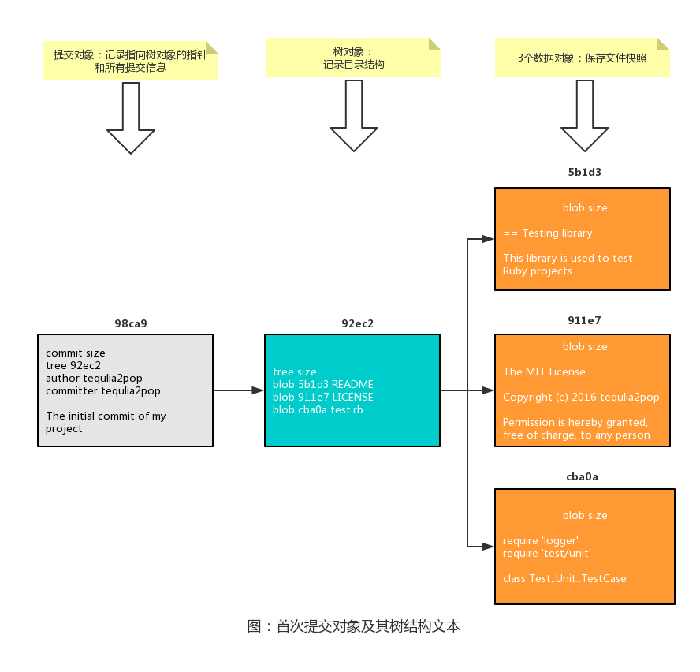

# 分支简介

几乎所有的版本控制系统都以某种形式支持分支。在分支的实现上，很多的版本控制系统常常需要完全创建一个源代码目录的副本。对于大型项目来说，这样的过程会耗费很多时间。

但是，Git 处理分支的方式却是难以置信的轻量：创建新分支的动作几乎能在瞬间完成，并且在不同分支之间的切换操作也是一样便捷。因此，有人把 Git 的分支模型称为它的“必杀技特性”。

要了解 Git 的分支模型，首先要知道 Git 是如何保存数据的。Git 保存的不是文件的变化或者差异，而是一系列不同时刻的文件快照。具体来说，Git 会：

*   使用数据对象（blob）保存文件快照。

*   使用树对象（tree object）记录目录结构。树对象包括一条或多条树对象记录，每条记录含有一个指向数据对象或者子树对象的指针。

*   使用提交对象（commit object）记录指向树对象的指针和所有提交信息。

Git 分支本质上仅仅是指向提交对象的指针，参考 [Git 引用-分支](../git-internals/git-references.md)。通过提交对象可以找到对应的树对象，而树对象实际上代表一个项目快照。这样 Git 就可以在需要的时候重现此次保存的快照。

可以将 Git 分支看作是包含所指向提交对象 SHA-1 校验和的文件，创建一个新分支就相当于往一个文件中写入 41 个字节（40 个字符的 SHA-1 值字符串和 1 个换行符）。这便是创建和销毁 Git 分支如此高效的原因。

## 示例说明

假设有一个工作目录，里面包含了三个文件。现在我们暂存并提交这三个文件：

```
$ git add README test.rb LICENSE
$ git commit -m 'The initial commit of my project'
```

当使用 `git add` 命令进行暂存操作时，Git 会为每一个文件计算 SHA-1 校验和，然后把当前版本的文件快照保存到 Git 仓库中（使用数据对象来保存它们），最终将 SHA-1 校验和加入到暂存区域等待提交。

当使用 `git commit` 命令进行提交操作时，Git 会先计算每一个子目录（本例中只有项目根目录）的 SHA-1 校验和，然后在 Git 仓库中将这些校验和保存为树对象。随后，Git 便会创建一个提交对象，它包含指向这个树对象（项目根目录）的指针，还包含了作者的姓名和邮箱、提交时输入的信息以及指向它的父对象的指针。

现在，Git 仓库中有五个对象：三个数据对象（保存了文件快照）、一个树对象（记录了目录结构和文件名），以及一个提交对象（包含着指向树对象的指针和所有提交信息）。



做些修改后再次提交，那么后面产生的提交对象会包含一个指向上次提交对象（父对象）的指针。可以看到，首次提交产生的提交对象没有父对象，普通提交操作产生的提交对象有一个父对象。如果是由多个分支合并产生的提交对象，那么它会有有多个父对象。


Git 的默认分支名字是 `master`。在多次提交操作之后，你其实已经有一个指向最后那个提交对象的 `master` 分支。它会在每次的提交操作中自动向前移动。

那么，Git 又是怎么知道当前在哪一个分支上呢？Git 有一个名为 `HEAD` 的特殊指针，它指向当前所在的本地分支（将 `HEAD` 想象为当前分支的别名）。`HEAD` 分支也会随着提交操作自动向前移动。

