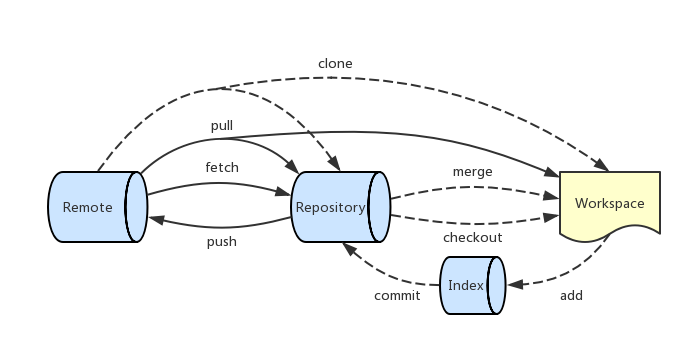

# 远程分支

远程分支（remote branch）是远程仓库的普通分支，包括在远程仓库创建的分支，以及 `push` 到远程仓库上的分支。

下列命令可以获得远程分支的详细信息：

```
$ git remote show (remote)
```

那么，本地分支是如何与远程分支进行通信的呢？Git 通常会使用到远程跟踪分支和跟踪分支两个概念。

让我们先看一下下面这张 Git 数据传输操作的流程图，其中标记为实线的部分是我们所关注的涉及远程分支的操作：



## 远程跟踪分支与跟踪分支

当克隆一个远程仓库时，Git 会创建远程跟踪分支和跟踪分支。默认情况下，Git 会创建一个名为 `origin/master` 的远程跟踪分支，以及一个跟踪 `origin/master` 的名为 `master` 跟踪分支。

**远程跟踪分支（remote-tracking branch）**

远程跟踪分支是对远程分支的引用，参考 [Git 引用-远程引用](../git-internals/git-references.md)。远程跟踪分支就像是用户上次连接到远程仓库时远程分支所处状态的书签。用户不能移动远程跟踪分支；当用户执行网络通信操作时，远程跟踪分支会自动移动。

远程跟踪分支的作用在于：如果另一个用户已经对远程分支进行了更新，即远程分支已经具有比本地分支更为新的提交，则不允许用户对远程分支进行更新。用户必须首先从远程分支获取新的提交，并将新的提交合并到本地分支中，然后才可以将更改推送到远程分支。判定这种情况的方法就是使用远程跟踪分支与远程分支进行比较。

*   远程跟踪分支从远程仓库获取内容，这是通过 `git fetch` 和 `git pull` 命令来完成的。

*   用户无法修改远程跟踪分支。

**跟踪分支（tracking branch）**

从远程跟踪分支检出本地分支会自动创建一个“跟踪分支”（也叫做 “上游分支”）。跟踪分支实际上是存储在 `.git/config` 文件中的 [branch] 配置，它指明了本地分支对应的远程仓库和远程分支分别是哪一个。例如：

```
[branch "localfeature"]
	remote = origin
	merge = refs/heads/feature
```

以上 [branch] 配置表示本地 `localfeature` 分支跟踪的是 `origin` 远程仓库的 `feature` 分支。

可以使用下面的命令来查看 `master` 分支的跟踪分支：

```
$ git config -l | grep 'branch\.master'
branch.master.remote=origin
branch.master.merge=refs/heads/master
```

跟踪分支的作用在于：它为本地分支和远程分支之间建立了一种联系，方便了本地分支和远程分支的同步。如果在一个跟踪分支上输入 `git pull`，Git 能自动地识别去哪个服务器上抓取数据、合并到哪个分支。

*   跟踪分支从远程跟踪分支获取内容，这是通过 `git merge` 和 `git pull` 命令来完成的。

*   用户在跟踪分支上工作，当然可以修改跟踪分支。

*   用户可以在跟踪分支上进行提交并 `push` 到远程仓库，在更新远程仓库的同时也会更新远程跟踪分支。

分支类型 | 更新方式 | 发布方式 | 客户端访问
-------- | -------- | -------- | ----------
远程跟踪分支 | `git fetch`、`git pull` | 【不发布】 | 只读
跟踪分支 | `git merge`、`git pull`（=`git fetch`+`git merge`） | `git push` | 读写

### 跟踪分支的操作

**设置跟踪分支**

当克隆一个仓库时，通常会自动地创建一个跟踪 `origin/master` 的 `master` 分支。 然而，如果你愿意的话可以设置其他的跟踪分支 - 其他远程仓库上的跟踪分支，或者不跟踪 `master` 分支。 

```
git checkout -b [branch] [remotename]/[branch]
```

下列命令设置本地 `sf`  分支跟踪 `origin/serverfix` 分支。

```
$ git checkout -b sf origin/serverfix
Branch sf set up to track remote branch serverfix from origin.
Switched to a new branch 'sf'
```

这是一个十分常用的操作，所以 Git 提供了 `--track` 快捷方式：

```
$ git checkout --track origin/serverfix
Branch serverfix set up to track remote branch serverfix from origin.
Switched to a new branch 'serverfix'
```
	
设置已有的本地分支跟踪一个刚刚拉取下来的远程分支，或者想要修改正在跟踪的上游分支，可以使用 `-u` 或 `--set-upstream-to` 选项运行 `git branch`。

```
$ git branch -u (remote)/(branch) (branch)
```

下列命令使得 `master` 分支跟踪 `origin/master` 分支：

```
git branch -u origin/master master
```

下列命令使得当前分支跟踪 `origin/master` 分支：

```
git branch -u origin/master
```

**查看跟踪分支**

如果想要查看所有跟踪分支，可以使用 `git branch` 的 `-vv` 选项。这会列出所有本地分支的详细信息，包括与上游分支的关系：如每一个分支正在跟踪哪个远程分支、本地分支与远程分支之间的超前落后情况。

```
$ git branch -vv
  iss53     7e424c3 [origin/iss53: ahead 2] forgot the brackets
  master    1ae2a45 [origin/master] deploying index fix
* serverfix f8674d9 [teamone/server-fix-good: ahead 3, behind 1] this should do it
  testing   5ea463a trying something new
```

可以看到，`iss53` 分支正在跟踪 `origin/iss53` 分支，并且本地有两个提交还没有推送到服务器上；`master` 分支正在跟踪 `origin/master` 分支，并且是最新的；`serverfix` 分支正在跟踪 `teamone/server-fix-good` 分支，并且服务器上有一次提交还没有合并同时本地有三次提交还没有推送。

注意，这些数字的值来自于你从每个服务器上最后一次抓取的数据。这个命令并没有连接服务器，它只会告诉你关于本地缓存的服务器数据。 

如果想要统计最新的领先与落后数字，需要在运行此命令前抓取所有的远程仓库。

```
$ git fetch --all
$ git branch -vv
```

## 查看远程分支

`git branch` 命令默认显示所有的本地分支。

可以使用 `-r` 选项来查看远程分支，或者使用 `-a` 选项来查看所有的分支。

```
$ git branch -r
origin/master
$ git branch -a
* master
  remotes/origin/master
```

## 推送

当你想要公开分享一个分支时，需要将其推送到远程仓库上。

可以使用 `git push` 命令来执行推送：

```
$ git push (remote) (src-branch):(dest-branch)
```

其中，“src-branch” 指明了要推送的本地分支，而 “dest-branch” 指明了要推送到的远程分支。

对于 “src-branch” 和 “dest-branch” 两个参数，可以使用分支名字来做简单的映射，但是 Git 实际上自动将分支名字展开为引用规格（refspec）。关于引用规格，请参考[官方文档](https://git-scm.com/book/zh/v2/Git-%E5%86%85%E9%83%A8%E5%8E%9F%E7%90%86-%E5%BC%95%E7%94%A8%E8%A7%84%E6%A0%BC)。

如果省略参数来执行 `git push` 命令，Git 会通过 `remote.push` 配置或 `push.default` 配置来决定应该如何推送。默认情况下，`remote.push` 配置为空，而 Git 2.0 版本之后的 `push.default` 配置使用 `simple` 模式。这时 Git 会按照 `simple` 模式的约定来执行推送：

*   如果 `push` 的仓库是你通常 `pull` 的那一个仓库时，将当前分支推送到它跟踪的远程分支上，但是要求本地分支和上游分支具有相同的名字。

*   如果 `push` 的仓库并不是你通常 `pull` 的那一个仓库时，则是将当前分支推送到远程仓库上具有相同名字的分支。

参考 [push.default 配置](../git-configuration/push-default.md)。

## 抓取

使用 `git fetch` 可以从远程仓库中抓取本地没有的数据，并且更新本地仓库。该命令会移动远程跟踪分支指向最新的提交，实际上是将本地的远程跟踪分支更新成了远程仓库最新的状态。但是，`git fetch` 不会更新你的跟踪分支，也不会修改你的工作目录；换句话说，它不会修改你磁盘上的文件。

```
$ git fetch <remote> <branch>
```

下面的命令将获取远程仓库 `origin` 的所有更新：

```
$ git fetch origin
```

下面的命令将获取远程仓库 `origin` 的 `master` 分支的所有更新：

```
$ git fetch origin master
```

对于 `fetch` 回来的更新，在本地需要使用远程跟踪分支来读取，例如在 `git merge` 中可以指定要合并的分支是 `origin/master`。
	
## 合并

使用 `git merge` 命令可以将远程跟踪分支合并入本地分支。

```
$ git merge (branch-to-merge-from)
```

其中，`branch-to-merge-from` 指明了要合并的分支是哪一个，默认的目的分支是用户当前的分支。例如，`git merge origin/master` 命令将 `origin/master` 分支上的所有提交合并到用户的当前分支中。

## 拉取

实际上，由于先抓取更新再合并到本地分支这个流程很常用，因此 Git 提供了一个专门的命令来完成这两个操作。它就是 `git pull`。实际上，`git pull = git fetch + git merge`。

```
$ git pull <remote> <remote-branch>:<local-branch>
```

例如取回 `origin` 的 `next` 分支，与本地的 `master` 分支合并：

```
$ git pull origin next:master
```

如果是与当前分支合并，可以省略本地分支名：

```
$ git pull origin next
```

如果当前分支建立了跟踪分支，可以省略远程分支名：

```
$ git pull origin
```

上面命令表示，本地的当前分支自动与远程仓库 `origin` 的上游分支进行合并。

如果当前分支只有一个跟踪分支，连远程仓库都可以省略：

```
$ git pull
```

上面命令表示，本地的当前分支自动与唯一一个上游分支进行合并。

## 删除远程分支

可以运行带有 `--delete` 选项的 `git push` 命令来删除一个远程分支：

```
$ git push (remote-name) --delete (branch-name)
```

基本上这个命令做的只是从服务器上移除这个指针。 Git 服务器通常会保留数据一段时间直到垃圾回收运行，所以如果不小心删除掉了，通常是很容易恢复的。