# “跟踪分支”与“远程跟踪分支”

原文链接：http://www.gitguys.com/topics/tracking-branches-and-remote-tracking-branches/

**本节中使用的命令：**

*   git add

*   git commit

*   git clone

*   git push

*   git fetch

*   git merge

*   git pull

## 让我们谈谈跟踪

使用远程仓库时，您将看到以下术语：

*   跟踪分支（Tracking Branches）

*   远程跟踪分支（Remote Tracking Branches）

当使用 `git clone` 命令时，在 git 客户端上会创建跟踪分支和远程跟踪分支。

### 跟踪分支和远程跟踪分支：总结

以下是跟踪分支和远程跟踪分支的高层总结。本文的其余部分提供了跟踪分支和远程跟踪分支的示例。

**跟踪分支** – 高层总结：

*   **跟踪分支**通过 `git clone`、`git pull` 和 `git merge` 命令来获取内容（`git fetch` 仅更新**远程跟踪分支**）。

*   用户可以修改**跟踪分支**。

*   当用户在本地**跟踪分支**中执行 `git commit` 后 ，用户可以使用 `git push` 将跟踪分支的更改发布到远程仓库和**远程跟踪分支**上。

**远程跟踪分支**  - 高层总结：

*   **远程跟踪分支**通过 `git clone`、`git pull` 和 `git fetch` 命令来获取内容（`git merge` 仅更新**跟踪分支**）。

*   用户不应该修改**远程跟踪分支**（不要尝试修改**远程跟踪分支**，例如通过 `git checkout` 将 git 分支设置为**远程跟踪分支**）。

*   **远程跟踪分支**从远程仓库来获取内容。

分支类型 | 更新方式 | 发布方式 | 客户端访问
-------- | -------- | -------- | ----------
远程跟踪分支 | `git fetch`、`git pull` | 【不发布】 | 只读
跟踪分支 | `git merge`、`git pull`（=`git fetch`+`git merge`） | `git push` | 读写

以下示例演示了如何使用分支。

## 示例：我们的仓库

对于下面的示例，让我们从一个有2个提交的小型仓库开始：

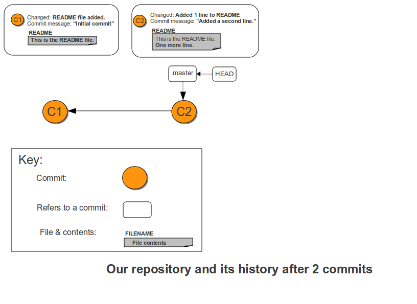

以下是创建上述提交的会话示例：

```
$ echo This is the README file. > README
$ git add README
$ git commit -m 'Initial commit'
[master (root-commit) df9a777] Initial commit
 1 file changed, 1 insertion(+)
 create mode 100644 README
$ echo One more line. >> README
$ git commit -a -m "Added a second line."
[master 79e7edb] Added a second line.
 1 file changed, 1 insertion(+)
$ ls
README
```

假设 git 管理员创建了远程仓库，另一个用户使用 `git push` 发布了上面的提交。

我们不会在这里展示如何创建远程仓库，因为这已经在 [Git Remotes: Sharing](http://www.gitguys.com/topics/creating-a-shared-repository-users-sharing-the-repository/) 中讨论过了  。本文的目的是从 git 客户端的角度讨论远程仓库，而不是如何设置远程仓库。

下面是具有两个提交（**C1** 和 **C2**）的远程仓库的图表：

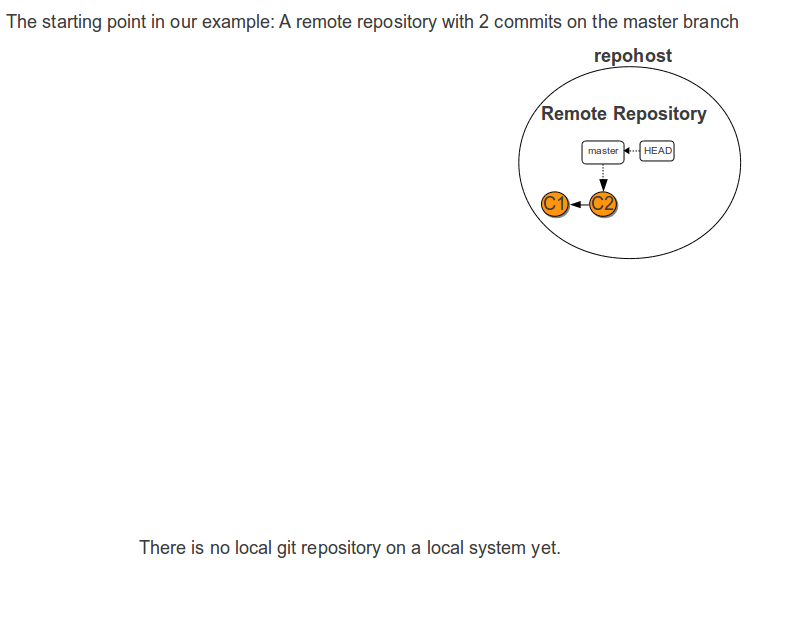

## git clone

然后输入：

```
$ git clone git@github.com:tequlia2pop/project1.git
```

通过上述命令，git 会执行一些操作，首先是设置**远程跟踪**分支：

*   新建一个名为 `origin/master` 的**远程跟踪**分支 

*   从 `git@github.com:tequlia2pop/project1.git` 将远程仓库复制到名为 `origin/master` 的**远程跟踪**分支上。

git 还没有完成 `git clone` 命令，但这是到目前为止它所做的工作：

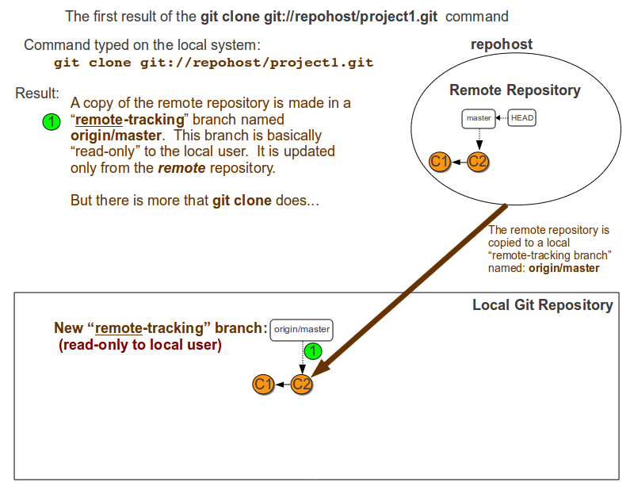

注意，**远程跟踪**分支对本地用户是*只读*的。例如，用户不能执行 `git checkout origin/master`，  因为用户不能直接编辑文件并将其添加到 `origin/master` 分支上。如果本地用户想要查看 `origin/master`  分支的变化，还有其他命令可用。

该 `git clone` 命令还没有完成。将远程仓库复制到**远程跟踪**分支后，git 将继续执行 `git clone`  命令的任务：

*   创建一个名为 `master` 的**跟踪**分支

*   将本地用户的 `master` 分支的指针设置为与**远程跟踪**分支 `origin/master` 指向相同的提交。

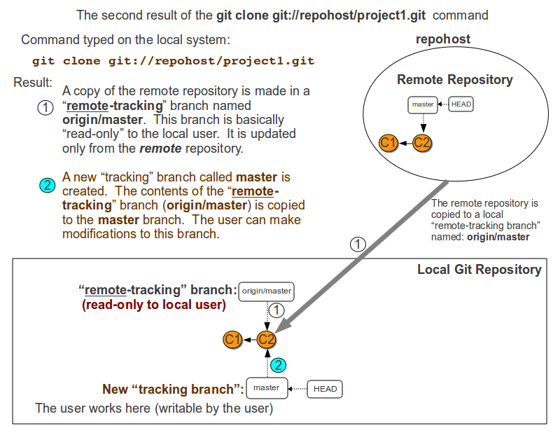

本地 git 用户现在可以修改 `master` 分支中的本地 git 仓库。

## 将文件添加到本地仓库

现在，本地 git 用户拥有了仓库的工作副本，当然可以添加文件了：

```
$ echo '# Beginnings of a Makefile' > Makefile
$ git add .
$ git commit -m "Added a Makefile"
```

通过添加第三个提交（在下图中标记为 **C3**），仓库现在如下所示：

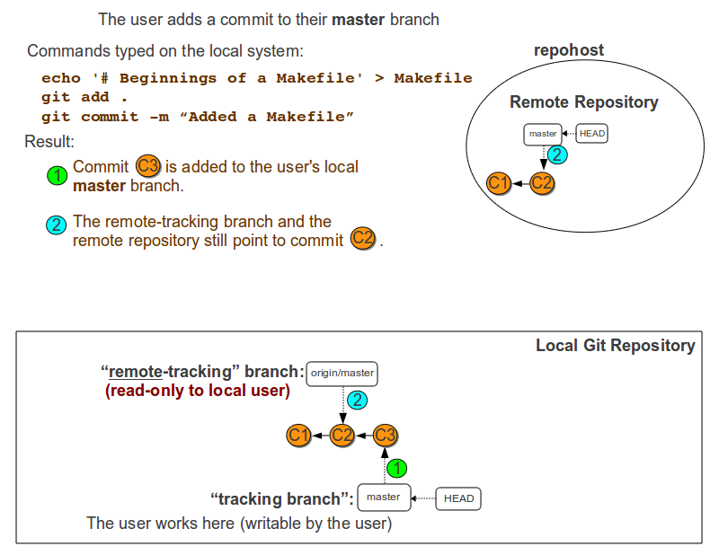

## 发布本地提交

要发布提交，用户输入 `git push`，该命令首先具有下列效果：将用户的本地 `master` 分支发布到远程仓库。在我们的示例中，添加了 `Makefile` 的新提交（提交 **C3**）被推送到远程仓库：

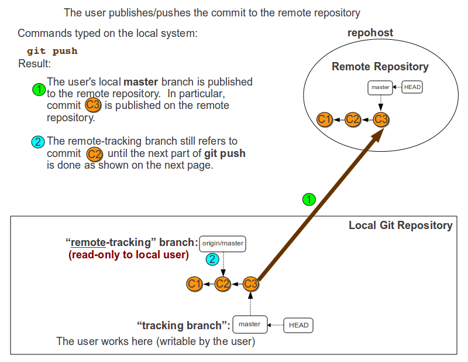

接下来，`git push` 命令使用来自远程仓库的最新内容来更新**远程跟踪**分支：

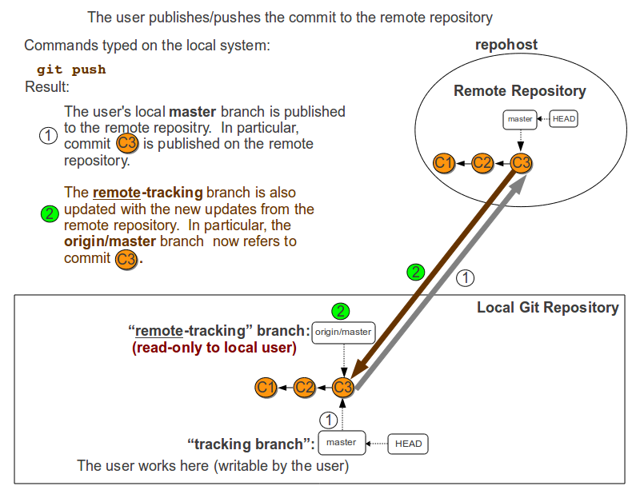

注意：如果远程仓库已由具有比本地 git 用户的存储库更新的提交的另一个用户进行更新，则用户不会被允许  推  送到远程存储库。用户必须首先从远程存储库获取新的提交，并将新的提交合并到本地主分支中。然后，用户将被允许将更改推送到远程存储库。

注意：如果另一个用户已经对远程仓库进行了更新，远程仓库已经具有比本地 git 用户的仓库更为新的提交，则不允许用户使用 `git push` 对远程仓库进行推送。用户必须首先从远程仓库获取新的提交，并将新的提交合并到本地 `master` 分支中。然后，用户才可以将更改推送到远程仓库。

此时，所有的3个分支（远程仓库的 `master` 分支，远程跟踪分支 `origin/master` 和跟踪分支  `master`）都包含相同的提交，即指向提交 **C3**。

## 另一个用户添加远程仓库

我们假设另一个用户也在使用这个新仓库，并且他们已经将一个新提交（下图中的 **C4**）推送到了远程仓库：

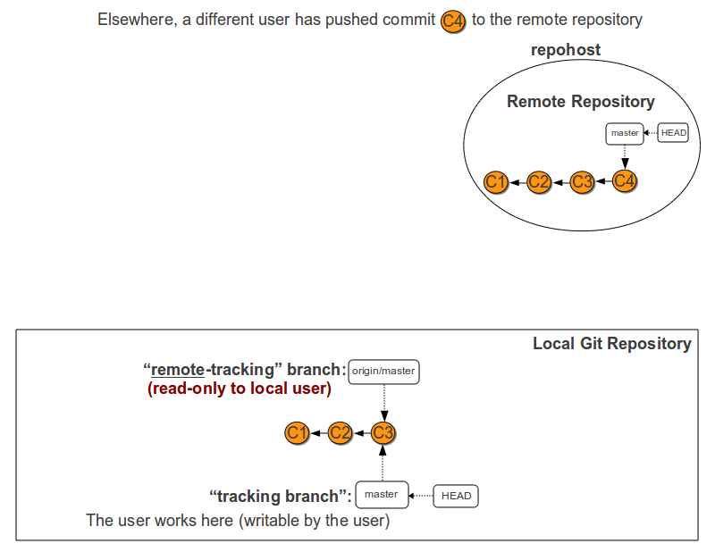

本地 git 仓库不包含新提交 **C4**，本地用户只有使用 `git pull` 或 `git fetch`。

## 获取新的提交

本地 git 用户希望将新提交复制到本地 git 仓库。他们决定通过两个步骤来完成，第一个步骤是 `git fetch`。 `git fetch` 将远程仓库中所有的更新复制到本地的**远程跟踪**分支中：

```
$ git fetch
```

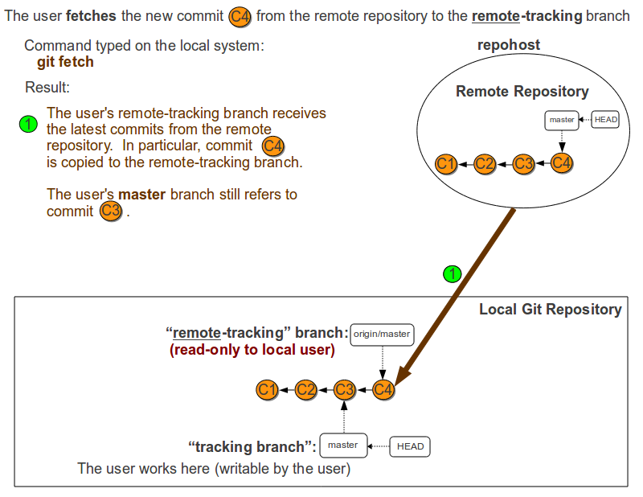

注意此时，用户的 `master` 分支还没有指向新提交；用户的 `master` 分支包含了提交 **C1**、**C2**  和  **C3**，却没有 **C4**，而**远程跟踪**分支指向了新提交 **C4**。

## 合并新的提交

然后，用户将**远程跟踪**分支中的新提交中合并到用户的工作目录中。这使得**远程跟踪**分支的新提交 **C4**  被合并到用户的名为 `master` 的本地工作分支上。对于我们的示例，假设用户没有对本地 `master` 分支执行过任何其他提交。

```
$ git merge origin/master
```

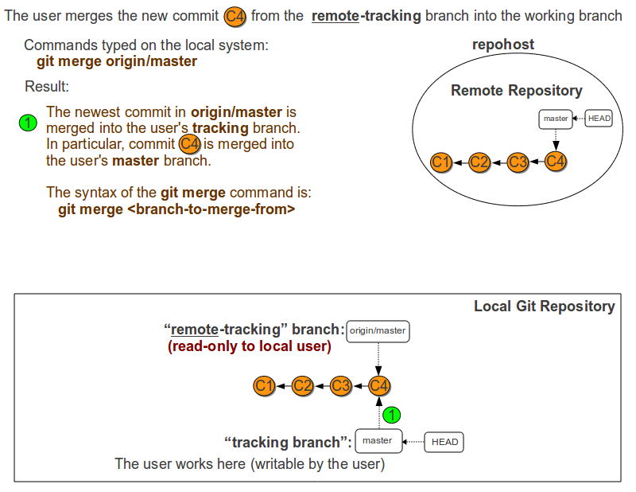

注意，`git merge` 命令的语法是 `git merge branch-to-merge-from`。`git merge origin/master` 命令将 `origin/master` 远程跟踪分支上的所有提交合并到用户的当前分支（`master` 分支）中。

## git pull = git fetch + git merge

如果用户确定他们想要将远程仓库中的所有新的更新合并（不仅仅是获取）到本地  `master` 仓库中，那么可以输入：

```
$ git pull
```

结果与用户这样输入是相同的：`git fetch`，紧接着是 `git merge origin/master`。

为了演示这一点，让我们回到只有远程仓库含有新提交 **C4** 的时间点，像这样：


`git pull` 的结果如下所示：

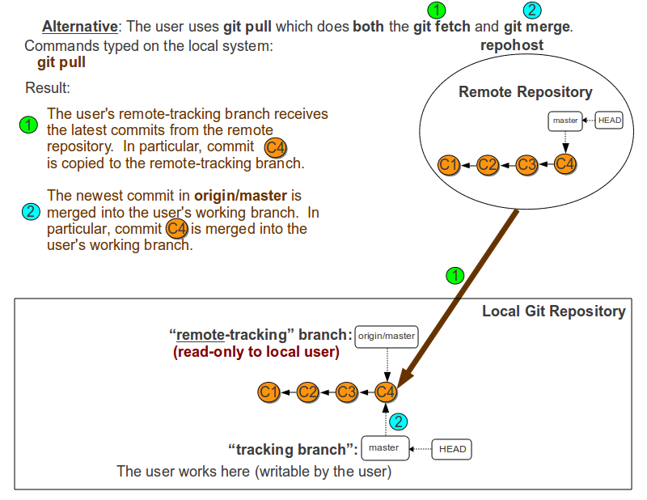

## 合并提交

如果用户在执行 `git pull` 或 `git merge` 之前已经向其本地 `master` 分支做了一些提交，那么 `git pull/ merge` 将会在用户本地的跟踪分支上创建一个新的提交（合并提交）。

用户最终会将新提交（包括他们之前已经做过的提交和合并提交）推送到远程仓库。