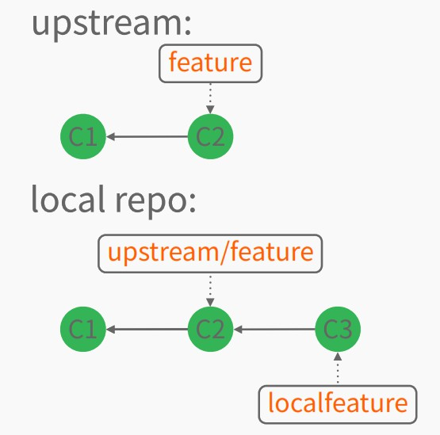

# push.default 配置

## push 操作如何解析省略的参数

例如，要将本地仓库的 `localfeature` 分支推送到远程仓库 `upstream` 的 `featrue` 分支上，应该如何操作？



### 尝试1

```
$ git push upstream localfeature
```

在上面的命令中，refspec 参数为 `HEAD`，被解析为 `localfeature:localfeature`。所以该命令实际上等效于下面的命令：

```
$ git push upstream localfeature:localfeature
```

这会在远程仓库 `upstream` 上新建一个 `localfeature` 分支，然后将更新推送到这个新建的远程 `localfeature` 分支上，并且更新本地的远程跟踪分支 `upstream/localfeature`。

### 尝试2

```
$ git push upstream HEAD
```

在上面的命令中，refspec 参数为 `HEAD`，被解析为 `localfeature:localfeature`。所以该命令实际上等效于下面的命令：

```
$ git push upstream localfeature:localfeature
```

这和尝试1的结果是完全相同的。

### 尝试3

```
$ git push upstream
```

上面的命令省略了 refspec 参数，Git 2.0 之前和之后的处理有些差异，但都无法按需推送。

在默认情况下：

*   Git 2.0 之前，`push.default` 配置默认为 `matching`，它只会将本地与远程都具有的同名的所有分支推送到远程仓库。

*   Git 2.0 之后，`push.default` 配置默认为 `simple`，它会将 `localfeature` 推送到它跟踪的远程分支上，但是要求本地分支和跟踪的远程分支同名。

### 尝试4

```
$ git push upstream :
```

上面的命令使用了特殊的 refspec 参数":"，与 Git 2.0 之前的 `git push upstream` 没有区别，但都无法按需推送。

### 尝试5

```
$ git push
```

以上的命令省略了远程仓库。如果当前分支 `localfeature` 配置了跟踪分支的话，那么会使用 `branch.localfeature.remote` 配置。否则，默认使用 `origin`；如果没有 `origin`，则会报错。

另外，省略了 refspec 配置，结果与前面几种处理方式一致。 

### 解决方法

前面介绍的几种省略参数的 `git push` 方式，都无法将本地仓库的 `localfeature` 分支推送到远程仓库 `upstream` 的 `featrue` 分支上。

有两种解决方法：

1.  `git push upstream localfeature:feature`

2.  在 `.git/config` 中增加 `remote.upstream.push` 配置：

	```
	[remote "upstream"]
	push = refs/heads/localfeature;refs/heads/feature
	```
	
	另外，确保配置了 `localfeature` 分支的跟踪分支，那么就可以直接运行 `git push` 了。

## push.default 配置的作用

通过 `push.default` 配置，可以让我们在 `push` 命令中省略 refspec 参数或 `remote.push` 配置。`push.default` 包含以下几个模式：

1.  **nothing**

	除非明确地给定了 refspec 参数或 `remote.push` 配置，否则不推送任何内容。这个模式试图通过强制声明 refspec 参数来避免可能潜在的错误。
	
	```
	[branch "localfeature"]
		remote = upstream
		merge = refs/heads/feature
	[push]
		default = nothing
	```
	
	在 `push.default = nothing` 模式下，运行 `git push upstream`，Git 将拒绝推送。

1.  **current**

    将当前分支推送到远程仓库上具有相同名字的分支。如果远程仓库上不存在该分支，则新建一个。
	
	central 以及 non-central 的工作流都可以使用这个模式。
	
	```
	[branch "localfeature"]
		remote = upstream
		merge = refs/heads/feature
	[push]
		default = current
	```
	
	在 `push.default = current` 模式下，运行 `git push upstream`，Git 将会在远程仓库 `upstream` 上新建一个 `localfeature` 分支，然后将更新推送到这个新建的远程 `localfeature` 分支上，并且更新本地的远程跟踪分支 `upstream/localfeature`。

1.  **upstream**

	将当前分支推送到它跟踪的远程分支上（也叫“上游分支”），前提自然是为当前分支设置了跟踪分支。只有在 `push` 的仓库是你通常 `pull` 的那一个仓库时，该模式才合理。
	
	这个模式只适用于推送到与拉取使用的是相同仓库的情况，比如 central 工作流。

	```
	[branch "localfeature"]
		remote = upstream
		merge = refs/heads/feature
	[push]
		default = upstream
	```
	
	在 `push.default = upstream` 模式下，运行 `git push upstream`，Git 会将 `localfeature` 分支推送到远程 `feature` 分支上，并且更新本地的远程跟踪分支 `upstream/feature`。

1.  **simple**
	
	在 central 工作流中，`simple` 模式和 `upstream` 模式是一样的，都是将当前分支推送到它跟踪的远程分支上；但是要求本地分支和上游分支具有相同的名字。
	
	在 noncentral 工作流中，也就是 `push` 的仓库并不是你通常 `pull` 的那一个仓库时，`simple` 模式和 `current` 模式是一样的，都是将当前分支推送到远程仓库上具有相同名字的分支。
	
	`simple` 模式在 Git 1.7.11 版本引入，并在 Git 2.0 版本后成为默认值。
	
	```
	[branch "localfeature"]
		remote = upstream
		merge = refs/heads/feature
	[push]
		default = simple
	```
	
	在 `push.default = simple` 模式下，运行 `git push upstream`，Git 将拒绝推送，因为当前分支与它所跟踪的远程分支名字不同。

1.  **matching**

    将本地与远程都具有的同名的分支全部推送到远程仓库。

    `matching` 模式是 Git 2.0 版本前的默认值。
	
	```
	[branch "localfeature"]
		remote = upstream
		merge = refs/heads/feature
	[push]
		default = matching
	```
	
	在 `push.default = matching` 模式下，运行 `git push upstream`，Git 将不会推送本地 `localfeature` 分支，因为远程仓库没有这个名字的分支。
	
配置 `push.default` 的命令如下：

```
$ git config --global push.default simple
```