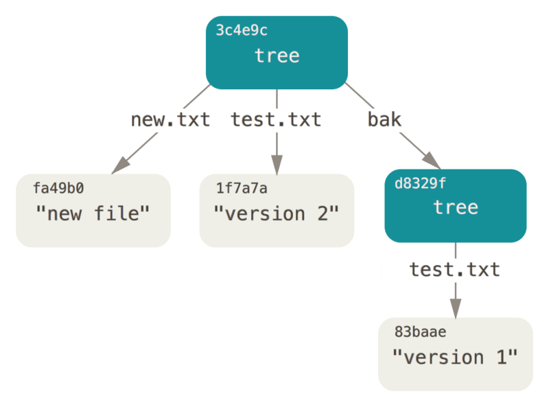

# Git 对象

## 对象存储

Git 以一种类似于 UNIX 文件系统的方式存储内容，但作了些许简化。 所有内容均以树对象和数据对象的形式存储，其中树对象对应了 UNIX 中的目录项，数据对象则大致上对应了 inodes 或文件内容。

*   数据对象：保存数据的内容。

*   树对象：包含了一条或多条树对象记录（tree entry），每条记录含有一个指向数据对象或者子树对象的 SHA-1 指针，以及相应的模式、类型、文件名信息。

	树对象的格式：依次指定模式、类型、数据对象或子树对象的 SHA-1 指针，以及文件名。示例如下：
	
	```
	100644 blob a906cb2a4a904a152e80877d4088654daad0c859      README
	100644 blob 8f94139338f9404f26296befa88755fc2598c289      Rakefile
	040000 tree 99f1a6d12cb4b6f19c8655fca46c3ecf317074e0      lib
	```

	树对象记录了文件目录结构，还解决了文件名保存的问题。树对象实际上代表一个项目快照。

*   提交对象：包含了一个指向树对象和父提交对象（如果有的话）的 SHA-1 指针，以及相应的作者/提交者信息和提交注释。 

	提交对象的格式：首先指定一个顶层树对象，代表当前项目快照；然后是作者/提交者信息（依据你的 `user.name` 和 `user.email` 配置来设定，外加一个时间戳）；然后留空一行；最后是提交注释。示例如下：

	```
	tree 0155eb4229851634a0f03eb265b69f5a2d56f341
	parent 11ea6202c0df0b25dd2af389965bbccd33a48ce1
	author tequlia2pop <tequlia2pop@gmail.com> 1507780225 +0800
	committer tequlia2pop <tequlia2pop@gmail.com> 1507780225 +0800

	second commit
	```
	
	我们可以通过提交对象来重用项目快照。
	
*   标签对象：对于附注标签，Git 会创建一个标签对象。标签对象非常类似于一个提交对象——它包含了一个指向 Git 对象的 SHA-1 指针、以及相应的标签创建者信息（外加一个时间戳）和注释信息。 主要的区别在于，标签对象通常指向一个提交对象，而不是一个树对象。 标签对象像是一个永不移动的分支引用——永远指向同一个提交对象，只不过给这个提交对象加上一个更友好的名字罢了。

	```
	object b6fbf7412bd9fa2bec1a5faba907f2232fa4f237
	type commit
	tag v1.1
	tagger tequlia2pop <tequlia2pop@gmail.com> 1507860588 +0800

	test tag
	```
	
Git 对象都有一个 SHA-1 校验和作为自己的唯一标识。那么这个 SHA-1 校验和是如何计算的呢？Git 会将待存储的数据外加一个头部信息（header）一起做 SHA-1 校验运算得到一个 SHA-1 校验和。这是一个长度为 40 个字符的值。

Git 以对象类型作为开头来构造一个头部信息，接着会添加一个空格，随后是数据内容的长度，最后是一个空字节（null byte）。Git 数据对象、树对象和提交对象的头部信息分别以字符串“blob”、“commit”或“tree”开头。

```
header = "blob|commit|tree #{content.length}\0"
```

Git 会将每一个 Git 对象保存为一个文件，并使用对应 SHA-1 校验和来为文件命名。具体来说，Git 会使用 SHA-1 值的前两个字符作为子目录名称，后 38 个字符则作为子目录内文件的名称。

### 数据对象存储示例

通过在 Ruby 脚本语言中交互式地演示，你将看到一个数据对象——本例中是字符串“what is up, doc?”——是如何被存储的。

可以通过 `irb` 命令启动 Ruby 的交互模式：

```
$ irb
>> content = "what is up, doc?"
=> "what is up, doc?"
```

Git 以对象类型作为开头来构造一个头部信息，本例中是一个“blob”字符串。 接着 Git 会添加一个空格，随后是数据内容的长度，最后是一个空字节（null byte）：

```
>> header = "blob #{content.length}\0"
=> "blob 16\u0000"
```

Git 会将上述头部信息和原始数据拼接起来，并计算出这条新内容的 SHA-1 校验和。在 Ruby 中可以这样计算 SHA-1 值——先通过 `require` 命令导入 SHA-1 digest 库，然后对目标字符串调用 `Digest::SHA1.hexdigest()`：

```
>> store = header + content
=> "blob 16\u0000what is up, doc?"
>> require 'digest/sha1'
=> true
>> sha1 = Digest::SHA1.hexdigest(store)
=> "bd9dbf5aae1a3862dd1526723246b20206e5fc37"
```

Git 会通过 zlib 压缩这条新内容。在 Ruby 中可以借助 zlib 库做到这一点。先导入相应的库，然后对目标内容调用 `Zlib::Deflate.deflate()`：

```
>> require 'zlib'
=> true
>> zlib_content = Zlib::Deflate.deflate(store)
=> "x\x9CK\xCA\xC9OR04c(\xCFH,Q\xC8,V(-\xD0QH\xC9O\xB6\a\x00_\x1C\a\x9D"
```

最后，需要将这条经由 zlib 压缩的内容写入磁盘上的某个对象。要先确定待写入对象的路径（SHA-1 值的前两个字符作为子目录名称，后 38 个字符则作为子目录内文件的名称）。如果该子目录不存在，可以通过 Ruby 中的 `FileUtils.mkdir_p()` 函数来创建它。接着，通过 `File.open()` 打开这个文件。最后，对上一步中得到的文件句柄调用 `write()` 函数，以向目标文件写入之前那条 zlib 压缩过的内容：

```
>> path = '.git/objects/' + sha1[0,2] + '/' + sha1[2,38]
=> ".git/objects/bd/9dbf5aae1a3862dd1526723246b20206e5fc37"
>> require 'fileutils'
=> true
>> FileUtils.mkdir_p(File.dirname(path))
=> ".git/objects/bd"
>> File.open(path, 'w') { |f| f.write zlib_content }
=> 32
```

就是这样——你已创建了一个有效的 Git 数据对象。所有的 Git 对象均以这种方式存储，区别仅在于类型标识——另两种对象类型的头部信息以字符串“commit”或“tree”开头，而不是“blob”。另外，虽然数据对象的内容几乎可以是任何东西，但提交对象和树对象的内容却有各自固定的格式。

## 数据对象（blob）

Git 是一个内容寻址文件系统。这意味着 Git 的核心部分是一个简单的键值对数据库（key-value data store）。 你可以向该数据库插入任意类型的内容，它会返回一个键值，之后可以通过该键值再次检索该内容。

可以通过底层命令 `hash-object` 来演示上述效果——该命令可将任意数据保存于 `.git` 目录，并返回相应的键值。

### 使用底层命令来存取数据	

1.  初始化一个新的 Git 版本库，并确认 `objects` 目录为空：

	```
	$ git init test
	Initialized empty Git repository in /tmp/test/.git/
	$ cd test
	$ find .git/objects
	.git/objects
	.git/objects/info
	.git/objects/pack
	$ find .git/objects -type f
	```
	
	可以看到 Git 对 `objects` 目录进行了初始化，并创建了 `pack` 和 `info` 子目录，但均为空。
	
2.  往 Git 数据库存入一些文本：

	```
	$ echo 'test content' | git hash-object -w --stdin
	d670460b4b4aece5915caf5c68d12f560a9fe3e4
	```
	
	该命令输出一个长度为 40 个字符的校验和。这是一个 SHA-1 哈希值——将待存储的数据外加一个头部信息（header）一起做 SHA-1 校验运算而得的校验和。
	
3.  查看 Git 是如何存储数据的：

	```
	$ find .git/objects -type f
	.git/objects/d6/70460b4b4aece5915caf5c68d12f560a9fe3e4
	```

	可以在 `objects` 目录下看到一个文件，这个文件正是用来存储数据的。Git 会使用上一步骤生成的 SHA-1 校验和为文件命名：校验和的前两个字符用于命名子目录，余下的 38 个字符则用作文件名。
	
4.  从 Git 取回数据：

	```
	$ git cat-file -p d670460b4b4aece5915caf5c68d12f560a9fe3e4
	test content
	```
	
### 使用底层命令来存取文件

1.  创建一个新文件并将其内容存入数据库：

	```
	$ echo 'version 1' > test.txt
	$ git hash-object -w test.txt
	83baae61804e65cc73a7201a7252750c76066a30
	```

2.  向文件里写入新内容，并再次将其存入数据库：

	```
	$ echo 'version 2' > test.txt
	$ git hash-object -w test.txt
	1f7a7a472abf3dd9643fd615f6da379c4acb3e3a
	```
	
3.  查看 Git 是如何存储数据的：

	```
	$ find .git/objects -type f
	.git/objects/1f/7a7a472abf3dd9643fd615f6da379c4acb3e3a
	.git/objects/83/baae61804e65cc73a7201a7252750c76066a30
	```
	
	可以看到，数据库记录下了该文件的两个不同版本。
	
4.  将文件内容恢复到第一个版本：

	```
	$ git cat-file -p 83baae61804e65cc73a7201a7252750c76066a30 > test.txt
	$ cat test.txt
	version 1
	```
	
5.  再将文件内容恢复到第二个版本：

	```
	$ git cat-file -p 1f7a7a472abf3dd9643fd615f6da379c4acb3e3a > test.txt
	$ cat test.txt
	version 2
	```

## 树对象（tree object）

一个树对象包含了一条或多条树对象记录（tree entry），每条记录含有一个指向数据对象或者子树对象的 SHA-1 指针，以及相应的模式、类型、文件名信息。

*   Git 的文件模式参考了常见的 UNIX 文件模式，但远没那么灵活。具体参考下表：

	分类 | 文件模式编码 | 文件模式说明
	---- | ------------ | ------------
	数据对象 | 100644 | 普通文件
	数据对象 | 100755 | 可执行文件
	数据对象 | 120000 | 符号链接
	目录项 | 040000 |
	子模块 | | 

*   常用的类型有 `blob` 和 `tree`。

*   数据对象仅保存文件的内容，文件名由树对象保存。

例如，某项目当前对应的最新树对象可能是这样的：

```
$ git cat-file -p master^{tree}
100644 blob a906cb2a4a904a152e80877d4088654daad0c859      README
100644 blob 8f94139338f9404f26296befa88755fc2598c289      Rakefile
040000 tree 99f1a6d12cb4b6f19c8655fca46c3ecf317074e0      lib
```

`master^{tree}` 语法表示 `master` 分支上最新的提交所指向的树对象。注意，`lib` 子目录（所对应的那条树对象记录）并不是一个数据对象，而是一个指针，其指向的是另一个树对象：

```
$ git cat-file -p 99f1a6d12cb4b6f19c8655fca46c3ecf317074e0
100644 blob 47c6340d6459e05787f644c2447d2595f5d3a54b      simplegit.rb
```

从概念上讲，Git 内部存储的数据有点像这样：


通常，Git 根据某一时刻暂存区（即 index 区域）所表示的状态创建并记录一个对应的树对象，如此重复便可依次记录（某个时间段内）一系列的树对象。

### 使用底层命令来创建树对象

1.  将 test.txt 文件的首个版本加入一个新的暂存区。

	使用底层命令 `update-index` 来创建暂存区，同时指定 `--add` 选项（因为此前该文件并不在暂存区中）和 `--cacheinfo`（因为将要添加的文件位于 Git 数据库中，而不是位于当前目录下），另外还需要指定文件模式、SHA-1 与文件名。

	```
	$ git update-index --add --cacheinfo 100644 83baae61804e65cc73a7201a7252750c76066a30 test.txt
	```
	
2.  将暂存区内容写入一个树对象，并观察它的结构。

	```
	$ git write-tree
	d8329fc1cc938780ffdd9f94e0d364e0ea74f579
	$ git cat-file -p d8329fc1cc938780ffdd9f94e0d364e0ea74f579
	100644 blob 83baae61804e65cc73a7201a7252750c76066a30      test.txt
	```
	
3.  验证一下它确实是一个树对象。
	
	```
	$ git cat-file -t d8329fc1cc938780ffdd9f94e0d364e0ea74f579
	tree
	```

4.  创建一个新的树对象，它包括 test.txt 文件的第二个版本，以及一个新的文件。
	
	```
	$ echo 'new file' > new.txt
	$ git update-index --cacheinfo 100644 1f7a7a472abf3dd9643fd615f6da379c4acb3e3a test.txt
	$ git update-index test.txt
	$ git update-index --add new.txt
	```

5.  将暂存区内容再次写入一个树对象，并观察它的结构。

	```
	$ git write-tree
	0155eb4229851634a0f03eb265b69f5a2d56f341
	$ git cat-file -p 0155eb4229851634a0f03eb265b69f5a2d56f341
	100644 blob fa49b077972391ad58037050f2a75f74e3671e92      new.txt
	100644 blob 1f7a7a472abf3dd9643fd615f6da379c4acb3e3a      test.txt
	```
	
6.  将第一个树对象加入第二个树对象，使其成为新的树对象的一个子目录。

	通过调用 `read-tree` 命令，可以把树对象读入暂存区。本例中，可以通过对 `read-tree` 指定 `--prefix` 选项，将一个已有的树对象作为子树读入暂存区。

	```
	$ git read-tree --prefix=bak d8329fc1cc938780ffdd9f94e0d364e0ea74f579
	$ git write-tree
	3c4e9cd789d88d8d89c1073707c3585e41b0e614
	$ git cat-file -p 3c4e9cd789d88d8d89c1073707c3585e41b0e614
	040000 tree d8329fc1cc938780ffdd9f94e0d364e0ea74f579      bak
	100644 blob fa49b077972391ad58037050f2a75f74e3671e92      new.txt
	100644 blob 1f7a7a472abf3dd9643fd615f6da379c4acb3e3a      test.txt
	```

如果基于这个新的树对象创建一个工作目录，你会发现工作目录的根目录包含两个文件以及一个名为 bak 的子目录，该子目录包含 test.txt 文件的第一个版本。可以认为 Git内部存储着的用于表示上述结构的数据是这样的：



## 提交对象（commit object）

1.  为之前创建的第一个树对象创建一个提交对象。
	
	```
	$ echo 'first commit' | git commit-tree d8329fc1cc938780ffdd9f94e0d364e0ea74f579
	11ea6202c0df0b25dd2af389965bbccd33a48ce1
	```
	
2.  查看这个新提交对象。
	
	```
	$ git cat-file -p 11ea6202c0df0b25dd2af389965bbccd33a48ce1
	tree d8329fc1cc938780ffdd9f94e0d364e0ea74f579
	author tequlia2pop <tequlia2pop@gmail.com> 1507779355 +0800
	committer tequlia2pop <tequlia2pop@gmail.com> 1507779355 +0800

	first commit
	```
	
	提交对象的格式很简单：它先指定一个顶层树对象，代表当前项目快照；然后是作者/提交者信息（依据你的 `user.name` 和 `user.email` 配置来设定，外加一个时间戳）；然后留空一行；最后是提交注释。
	
3.  创建另两个提交对象，它们分别引用各自的上一个提交（作为其父提交对象）。
	
	```
	$ echo 'second commit' | git commit-tree 0155eb4229851634a0f03eb265b69f5a2d56f341 -p 11ea6202c0df0b25dd2af389965bbccd33a48ce1
	ba41935c2cee96a175aaf4a5ecf826390f111f2e
	$ echo 'third commit'  | git commit-tree 3c4e9cd789d88d8d89c1073707c3585e41b0e614 -p ba41935c2cee96a175aaf4a5ecf826390f111f2e
	b6fbf7412bd9fa2bec1a5faba907f2232fa4f237
	```
	
这三个提交对象分别指向之前创建的三个树对象快照中的一个。现在可以对最后一个提交的 SHA-1 值运行 `git log` 命令来查看 Git 提交历史了。

```
$ git log --stat b6fbf7412bd9fa2bec1a5faba907f2232fa4f237
commit b6fbf7412bd9fa2bec1a5faba907f2232fa4f237
Author: tequlia2pop <tequlia2pop@gmail.com>
Date:   Thu Oct 12 11:54:14 2017 +0800

	third commit

 bak/test.txt | 1 +
 1 file changed, 1 insertion(+)

commit ba41935c2cee96a175aaf4a5ecf826390f111f2e
Author: tequlia2pop <tequlia2pop@gmail.com>
Date:   Thu Oct 12 11:50:25 2017 +0800

	second commit

 new.txt  | 1 +
 test.txt | 2 +-
 2 files changed, 2 insertions(+), 1 deletion(-)

commit 11ea6202c0df0b25dd2af389965bbccd33a48ce1
Author: tequlia2pop <tequlia2pop@gmail.com>
Date:   Thu Oct 12 11:35:55 2017 +0800

	first commit

 test.txt | 1 +
 1 file changed, 1 insertion(+)
```

我们仅凭几个底层操作便完成了一个 Git 提交历史的创建。这就是每次我们运行 `git add` 和 `git commit` 命令时， Git 所做的实质工作——将被改写的文件保存为数据对象，更新暂存区，记录树对象，最后创建一个指明了顶层树对象和父提交的提交对象。这三种主要的 Git 对象——数据对象、树对象、提交对象——最初均以单独文件的形式保存在 `.git/objects` 目录下。下面列出了目前示例目录内的所有对象，辅以各自所保存内容的注释：

```
$ find .git/objects -type f
.git/objects/01/55eb4229851634a0f03eb265b69f5a2d56f341 # tree 2
.git/objects/11/ea6202c0df0b25dd2af389965bbccd33a48ce1 # commit 1
.git/objects/1f/7a7a472abf3dd9643fd615f6da379c4acb3e3a # test.txt v2
.git/objects/3c/4e9cd789d88d8d89c1073707c3585e41b0e614 # tree 3
.git/objects/83/baae61804e65cc73a7201a7252750c76066a30 # test.txt v1
.git/objects/b6/fbf7412bd9fa2bec1a5faba907f2232fa4f237 # commit 3
.git/objects/ba/41935c2cee96a175aaf4a5ecf826390f111f2e # commit 2
.git/objects/d6/70460b4b4aece5915caf5c68d12f560a9fe3e4 # 'test content'
.git/objects/d8/329fc1cc938780ffdd9f94e0d364e0ea74f579 # tree 1
.git/objects/fa/49b077972391ad58037050f2a75f74e3671e92 # new.txt
```

如果跟踪所有的内部指针，将得到一个类似下面的对象关系图：

